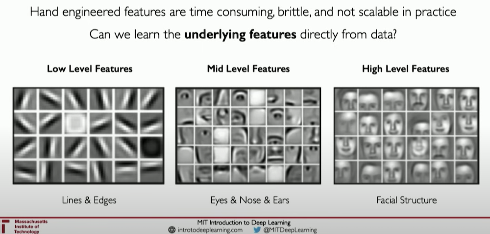
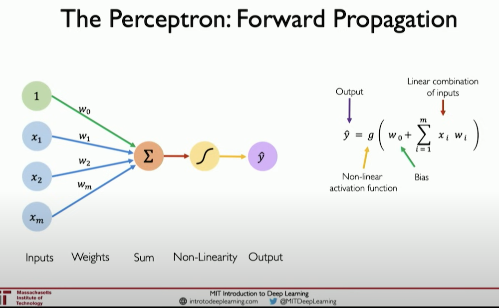
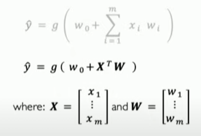

## Intro to Deep Learning - Lecture by Alexander Amini MIT (6.S191) Jan 9th, 2023 -> [Link](https://www.youtube.com/watch?v=QDX-1M5Nj7s)

### Definitions / Global Concepts

- **Intelligence:** _Ability to process information such that we can use it to inform some future decision or action taken._
- **AI, Aritificial Intelligence:** The outter 'wrapper' containing ML, Machine Learning which further contains DL, Deep Learning. AI Is _any technique that enables computers to mimic human behavior._
- **ML, Machine Learning:** Ability for a machine to learn, _without explicitly being programmed._
- **Deep Learning:** Subset of _ML that extracts patterns from data using neural networks._

### Deep Learning Contrasted with Machine Learning (General)

- Machine learning in general relies on a set of pre-, and well defined **features** which are almost always selected by a researcher or engineer with domain knowledge in the intended area of learning to train the machine. _Deep Learning_ however does _not_ pre-select or pre-define the set of _meaningful features,_ and relies on the machine to do so. Deep Learning aspires to _learn the underlying features directly from the data itself._

- Neural Networks and the basis of Deep Learning have been around in theoretical form from the late 1950's. But recently we have an unprecedented amount of relatively (to the 1950's) cheap compute power, along with other compute techniques like parallelism, distributed compute, etc.

### Perceptron (Base Mechanism in Neural Networks) (Forward Propagation)

- A **perceptron** is a _single neuron:_
- It takes a set of inputs $\{ x_1, x_2, x_m, ... \}$ and **multiplies them** by a corresponding **_weight_** $\ w $
- Then those values (input times corresponding weight) are summed up
- Then that resulting summation value is passed through an _nonlinear_ **_activation function_**.
- The final output is produced.
- There will need to be a scalar **_bias term_** which will allow a netowrk to _shift_ the activation function because it must be non-linear. _(green weight in diagram below)_

### (Perceptron Continued..)

- The weighted sum $ \Sigma $ of the inputs $ x_i $ : Is found by multiplying each $ x_i $ by it's corresponding $ w_i $ then adding those resulting products up.
- Next you'll add your bias value to that weighted sum.
- Then the _activation function_ takes in the weighted sum and produces the output $ y $

  

#### Activation Function Significance

  

    The purpose of an activation function is to introduce non-linearities into the network.
  

  

    All 'real world' data is highly non-linear
  

- The [Sigmoid function](https://en.wikipedia.org/wiki/Sigmoid_function) is very common in Deep Learning neural networks, it takes as input all real numbers, and outputs a value between 0 and 1, which is extremely useful in probability distributions.
