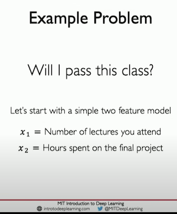
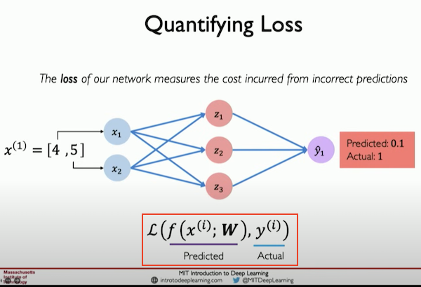
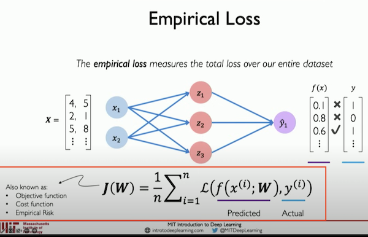

## Example Problem

- We are going to input 2 features, _Hours Spent Studying_ and _Number Of Lectures_ to be able to predict $ \hat{y} $ will the person pass a class. </img>

- _'Y-hat'_ refers to:
<ul style="margin-left: 1.5rem; margin-top: -0.5rem;">
<li> y typically represents the actual observed value or the target variable.</li>
<li> y-hat ($\hat{y}$) represents the model's prediction for that target variable, based on the input features.</li>
</ul >

## Quantifying Loss

- In the graphic below we're simulating what the 'first run' of inputs would yield in an **_untrained_** neural network with the inputs $ [4,5] $
- The loss of our network measures the cost incurred from **_incorrect predictions_**

## Empirical Loss

- The empirical loss measures the total loss over our **\_entire datased**\_

