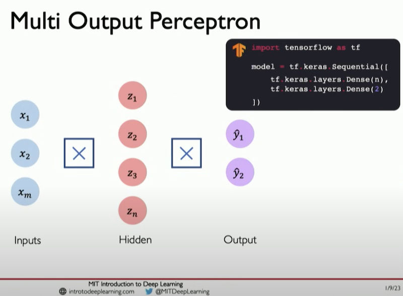
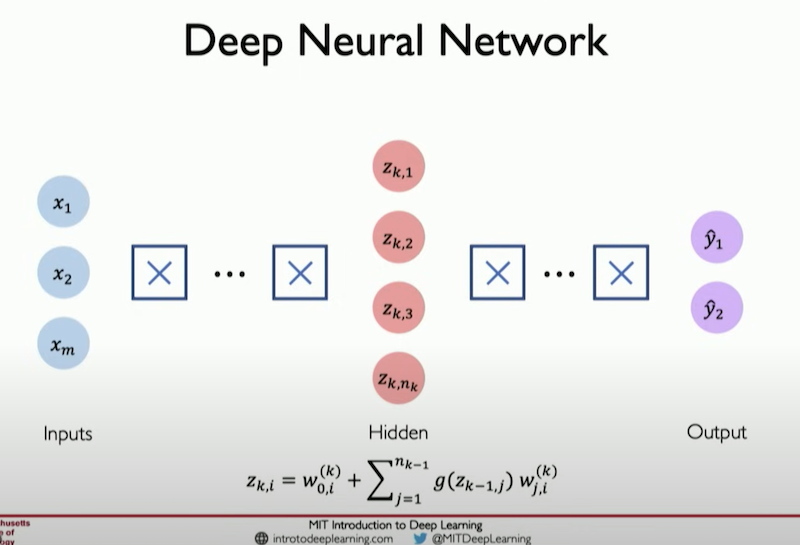

### Creating a Dense Layer Programatically (TensorFlow)

- Using tensorflow, the abstraction of a layer could be programmed below:

      class MyDenseLayer(tf.keras.layers.Layer):
        def **init**(self, input_dim, output_dim):
          super(MyDenseLayer, self).**init**()

          # Initialize weights and bias
          self.W = self.add_weight([input_dim, output_dim])
          self.b = self.add_weight([1, output_dim])

        def call(self, inputs):
          # Forward propagate the inputs
          z = tf.matmul(inputs, self.W) + self.b

          # Feed through a non-linear activation function
          output = tf.math.sigmoid(z)

          return output

#### Tensorflow's Abstraction

- `layers.Desne()` will allow you to quickly do the above individual layers using tensorflow api

- And then for multiple hidden layers it's the same thing replicated

